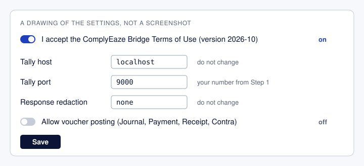
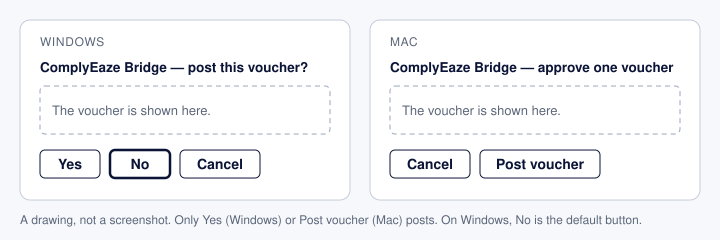

# Install ComplyEaze Bridge in Claude Desktop

ComplyEaze Bridge lets Claude, on your computer, read your TallyPrime books when you ask it a question.
These steps take you from nothing to your first answer. Do them in order. The steps themselves make no entry in your
books.

ComplyEaze Bridge is made by SPMS Comply Eaze Solutions LLP (ComplyEaze). Its source code is public.

What we checked ourselves, and what we did not. The Claude Desktop install screens and buttons in these steps are as
seen in our tests on 1 and 2 October 2026. On 2 October the Mac had Claude Desktop version 2.19675.0 (read from the
app's files); we did not record the version on the Windows PC. The TallyPrime keys (F1, Settings, Connectivity,
Ctrl+A, Alt+K, Alt+Y) and the Mac keys are written from general knowledge of those programs; we did not walk them
ourselves. On a Mac, the question in Step 6 ("Which company is open in Tally?") has not been run by us. These are
other companies' programs and they change, so a screen of yours may differ a little.

## Before you start

**You need three things on one computer:**

- **A Windows PC, or a Mac with an Apple chip (M1 or newer).** Macs with an Intel chip are not supported.
- **TallyPrime, opening on that same computer.** A Tally that you can open only on another computer cannot be reached.
- **Claude Desktop.** This is the Claude program you install on your computer; Claude in a web browser will not work
  for this. Get it from <https://claude.com/download>, install it, and sign in to your Claude account. In one test on
  Windows, a Claude account with no paid plan worked; we make no claim about other plans.

**Three things to know:**

- **Use a test company first.** Make a new company in TallyPrime with a few made-up entries (press **Alt+K**, choose
  **Create**, give it any name). It does not touch your other companies. Keep only the test company open in Tally while you
  try this. ComplyEaze Bridge is still being developed, so a release may contain errors:
  try it on test data first and keep current backups. To take a backup in TallyPrime, press **Alt+Y** and choose
  **Backup**.
- **What Claude reads from Tally is sent to Anthropic**, the company that runs Claude. With real books, that includes
  party names and amounts. Decide about real books after it works on the test company; see
  [When you move to real books](#when-you-move-to-real-books).
- **Claude cannot make entries in Tally unless you switch that on.** It is off when you install, and these steps leave
  it off.

> **On a Mac?** Do [Step 0](#step-0-mac-only-let-the-mac-reach-tally) first. On Windows, skip to Step 1.

## Step 0 (Mac only). Let the Mac reach Tally

TallyPrime is a Windows program. On a Mac it runs inside a Windows window made by a program such as Parallels or
VMware. Claude Desktop and ComplyEaze Bridge run on the Mac itself. So Tally's answers must be passed from the Windows
window to the Mac.

Keys inside the Windows window on a Mac laptop: for **F1** hold **fn** and press **F1**; **Alt** is the **Option**
key; **Ctrl** is the **Control** key.

1. Do **Step 1 inside the Windows window**, including the check, using the browser inside Windows (Microsoft Edge, from
   the Windows Start menu).
2. Then open **Safari on the Mac itself** and type the same address: `http://localhost:9000/status`.
   - You see the same short line from Tally: the Mac can reach Tally. Go on to Step 2, and do Steps 2 to 6 on the Mac
     itself, not inside Windows.
   - Safari says it cannot open the page: Tally is fine, but the Mac cannot reach it yet. This needs one setting in
     Parallels or VMware called **port forwarding**. Do not guess at it. A forwarding rule can make Tally reachable
     from other computers on the network. It must be set up, and approved, by
     whoever looks after the Mac for your organization, and used only on a network you trust. Not every edition of
     Parallels offers it. We do not yet have click-by-click steps. Send that person this message, with your own
     port number:

     > Please add a port forwarding rule to the Windows virtual machine on this Mac: TCP, from port 9000 on the Mac
     > to port 9000 in Windows. The Mac side must listen on the Mac's own loopback address only (127.0.0.1), not on
     > all of the Mac's addresses. If the rule cannot be limited like that, the Mac's firewall must block the port
     > from outside. Two tests: (1) `http://localhost:9000/status` opens in Safari on the Mac; (2) from another
     > computer on the same network, `http://<this Mac's network address>:9000/status` must NOT open.

In Claude Desktop on a Mac, a candidate build of 0.4.0 has been installed and its tools have loaded in a chat. The
package CI built for 0.4.1 was later installed over it, and two tools, `tally_status` and `list_companies`, answered
once from Tally in a chat on 2 October 2026. The question in Step 6 has not been run there. The
[README](../../README.md#what-has-been-run-against-a-real-tallyprime) lists what has been run and what has not.

## Step 1. Let Tally answer on your computer

Tally can answer other programs on the same computer, such as ComplyEaze Bridge. This is switched off until you turn
it on. It changes one setting in TallyPrime and no data.

**A caution before you turn it on.** With this setting on, Tally answers on the port to other computers too, without
asking for a password. In one test on 2 October 2026 with TallyPrime 7.1, a browser on another computer on the same
network opened the Tally computer's network address and the port, and got Tally's "TallyPrime Server is Running"
answer. ComplyEaze Bridge only ever calls Tally from this same computer, but the setting is Tally's own. What keeps
other computers out is this computer's firewall. Check that the firewall does not allow incoming connections to the
port, and that you are on a network you trust.

1. Open TallyPrime and open your test company.
2. Press **F1**. A Help menu opens. Choose **Settings**, then **Connectivity**.
3. Move to the line **Client/Server configuration** and press **Enter**.
4. Look at the line **TallyPrime acts as**. Write down what it says now, so that you can set it back one day.
5. On that line press **Enter**, choose **Both** from the list, and press **Enter**.
6. Look at the line **Port**. It shows a number, usually **9000**. Write the number down. You need it in Step 4.
7. Press **Ctrl+A** to save.
8. Close TallyPrime and open it again. Open the test company again.

**Check that it worked.** Open a web browser on the same computer. Click the long bar at the very top where web
addresses appear, delete what is there, type exactly this, and press **Enter**. Use your own number if it is not 9000.

    http://localhost:9000/status

| What you see | What it means |
| --- | --- |
| A short line of text that mentions Tally, such as "TallyPrime Server is Running" | It worked. Go to Step 2. |
| A list of search results | You typed in a search box. Type it in the long bar at the very top instead. |
| "This site can't be reached", or similar | Tally is closed, or the setting is not on yet, or the number is different. Check that TallyPrime is open, do Step 1 again, and make sure you closed and reopened TallyPrime. |
| The page keeps loading and nothing appears | Tally is busy. Wait a minute and try again, two or three times. Do not change the setting. |

## Step 2. Download ComplyEaze Bridge

1. Open the [Download page](https://bridge.complyeaze.com/download).
2. Click **Download for Windows** or **Download for Mac**, to match your computer. (On a Mac choose **Download for
   Mac**, even though Tally is inside Windows.)
3. The file goes to your **Downloads** folder. Its name starts with `bridge-tally` and ends with `.mcpb`. You do not
   need to open it; Step 3 does that.

Your browser or your computer may warn you about the file. The package is not yet code-signed or notarized, so your
computer cannot confirm who made it. Keep the file only if you got it from the page above.

## Step 3. Add it to Claude Desktop

1. Open Claude Desktop.
2. Open **Settings**. If you cannot find it, click your name or initials at the bottom left of the Claude window;
   Settings is in the list that opens.
3. Click **Extensions**, then **Advanced settings**.
4. Click **Install Extension…**. A file window opens. Go to **Downloads** and choose the file from Step 2.
5. A page opens with the name **ComplyEaze Bridge** and a **notice from Claude Desktop, in red**. The notice is
   Claude Desktop's own. It tells you that an extension is a program that gets access to your computer, and that this
   one is **not verified by Anthropic**. Both are true. Read it.
   - What ComplyEaze Bridge does with that access: it talks to Tally on this computer; it keeps a receipt of each
     tool call on this computer; it saves there the voucher files it prepares and the bank statements it reads; and
     it reads a file when a request names one.
   - If you do not want to go on, close the page and stop here.
6. To go on, click **Install**.
7. A small box asks **"Do you want to install ComplyEaze Bridge?"** Click **Install**.

## Step 4. Fill in the settings

A settings window opens with five lines. Go from top to bottom.

| Line | What to do | What it is |
| --- | --- | --- |
| **I accept the ComplyEaze Bridge Terms of Use (version 2026-10)** | Read the [Terms of Use](https://bridge.complyeaze.com/terms). Then switch this **on**. If you do not own the practice, the owner should read and agree first. | Your agreement. While it is off, ComplyEaze Bridge refuses every request and reads nothing from Tally. |
| **Tally host** | Do not change it. It says `localhost`. | "This computer". Only this computer is accepted. |
| **Tally port** | Type the number you wrote down in Step 1. | Where Tally answers. It is not a Tally licence port. Changing it here does not change Tally's own setting. |
| **Response redaction** | Do not change it. It says `none`. | A way to hide things from Claude. The other two values are `mask_parties` (shortens party names; some names are not shortened, see [Security and privacy](../security-and-privacy.md)) and `drop_narration` (leaves out narration). Any other word stops ComplyEaze Bridge from starting. Amounts are never hidden. |
| **Allow voucher posting (Journal, Payment, Receipt, Contra)** | Leave it **off**. | Lets Claude make entries in Tally, each one only after you approve it. |

Click **Save**.

## Step 5. Close Claude Desktop fully and open it again

ComplyEaze Bridge reads your acceptance of the Terms when it starts. Until Claude Desktop has been fully closed and
opened again, it can list its tools and still refuse every request. Closing the window is not enough; the program
keeps running in the background.

- **Windows:** look near the clock at the bottom right. If you do not see the Claude icon, click the small **^** arrow
  there. Right-click the Claude icon and choose **Quit**. Then open Claude Desktop again.
- **Mac:** click **Claude** in the menu bar at the top of the screen and choose **Quit Claude**. Then open Claude
  Desktop again.

Do this on both. In our one test of each, a Mac needed it and Windows did not. That was a first install. When we
installed a newer file over an installed one on a Mac, with the Terms switch already on, no quit was needed (one
test; see "Remove or update it").

## Step 6. Ask your first question

1. Make sure TallyPrime is open with your test company open.
2. In Claude Desktop, start a new chat and type: **Which company is open in Tally?**
3. Claude Desktop shows its own box asking whether Claude may use a tool from ComplyEaze Bridge. The buttons are
   **Deny**, **Always allow** and **Allow once**. Click **Allow once**. Claude will then ask you each time it wants to
   use a tool, which is the careful choice while you are trying it out. One question can need more than one tool.
4. Claude answers with the name of your test company. That is all. It is installed. (On a Mac this last result is
   the one we have not yet run ourselves; see the end of [Step 0](#step-0-mac-only-let-the-mac-reach-tally).)

**If something else happens:**

| What you see | What to do |
| --- | --- |
| Claude says the Terms are not accepted | Go back to Step 4, switch the first line on, click Save, then do Step 5. |
| Claude says it cannot reach Tally | Check that TallyPrime is open with a company open. Do the browser check in Step 1 again (on a Mac, in Safari on the Mac itself). Check that the Tally port in Step 4 is the same number. |
| Claude does not seem to know about Tally at all | Open Settings, then Extensions. Check that ComplyEaze Bridge is listed and switched on. Then do Step 5. In a new chat, **Connectors** also shows whether it is connected. |
| The settings window did not open in Step 4, or you want to change a setting | Open Settings, then Extensions. Click ComplyEaze Bridge, then **Configure**. |

Still stuck? See [Help](#help).

## When you move to real books

- **Decide who agrees.** What Claude reads, party names and amounts included, goes to Anthropic. How Anthropic keeps
  and uses it is set by your Claude account and Anthropic's own privacy policy. If the books belong to clients, the
  owner of the practice decides. How ComplyEaze Bridge itself handles information is in its
  [Privacy Policy](https://bridge.complyeaze.com/privacy).
- **Take a backup first** (Alt+Y, Backup, in TallyPrime).
- **Leave Tally's port alone.** Do not open it to the internet, and do not try to reach a Tally on another computer.
  ComplyEaze Bridge accepts only this computer.
- **Reading and posting are separate.** Asking questions reads. Preparing a voucher file and reading a bank statement
  write nothing to Tally. Only posting writes, and it is off.

## If you turn posting on

Posting means Claude makes an entry (a voucher) in Tally. It stays off unless you switch on **Allow voucher posting**
in the settings. Read [The limits of posting](#the-limits-of-posting) before you do.

Even with posting on, **every voucher needs your approval** in a separate ComplyEaze Bridge window that shows the
voucher:

- **Windows:** the window asks "post this voucher?" with **Yes**, **No** and **Cancel**. Only **Yes** posts. **No**
  is the button already chosen, so pressing Enter does not post.
- **Mac:** the window says "approve one voucher" with **Cancel** and **Post voucher**. Only **Post voucher** posts.

There is no tool to undo or delete a posted voucher. A wrong entry must be corrected by hand in Tally.

## Remove or update it

- **Remove:** open Settings, then Extensions, click ComplyEaze Bridge and uninstall it there. This changes nothing in
  Tally. If you want Tally as it was, set **TallyPrime acts as** back to what you wrote down in Step 1. Removing it
  does not remove ComplyEaze Bridge's data folder: the receipt log and the saved copies of vouchers, which are not
  masked, stay on the computer. Section 7 of the [Privacy Policy](https://bridge.complyeaze.com/privacy) explains how
  to archive or remove them.
- **Update:** it does not update by itself. Install the newer file as in Step 3. Claude Desktop showed an **Update**
  button: click it and follow the prompts. In our one test of this, on a Mac, going from 0.4.0 to the package CI
  built for 0.4.1, the settings and the Terms switch carried over, Claude Desktop started ComplyEaze Bridge by
  itself, and no quit was needed. That test covered Claude Desktop only: if another program also uses ComplyEaze
  Bridge, stop it first, as the paragraph on upgrading under "The limits of posting" says. Then look at the settings in Step 4. If you had an earlier version, check
  **Allow voucher posting**: an earlier default may still be saved as on.

## Help

- Questions and problems: [open an issue on GitHub](https://github.com/ComplyEaze/bridge/issues), or write to
  contact@complyeaze.com. Say which step you were on and what the screen showed. Do not send client names or figures.
- Something that looks like a security problem: follow [SECURITY.md](../../SECURITY.md), not a public issue.

## For IT staff

- **Checking the download.** Releases are on [GitHub Releases](https://github.com/ComplyEaze/bridge/releases), the
  newest first. Each archive has a same-named `.sha256` file and a small provenance record on its release, so an
  organization can identify the downloaded bytes and the source commit. Run `certutil -hashfile <file> SHA256` on
  Windows or `shasum -a 256 <file>` on a Mac and compare the result with the `.sha256` file.
- **Build attestation.** From 0.4.0 each archive also has a build attestation, which `gh attestation verify` can
  check. It says which workflow run and commit produced those bytes. It is not a code signature, no client checks it
  yet, and it does not show that the code is safe.
- **Platforms.** The packages target Windows x64 and Apple Silicon Mac (ARM64); Intel Mac and other platforms are not
  qualified. Package availability is not a host-validation claim; read each release's notes for its current gaps.
- **Other ways in.** Opening the `.mcpb` file directly may also start the install. To run from source instead, use the
  [source MCP setup](./README.md).

## The limits of posting

Voucher file preparation and bank-statement parsing are available by default;
they write nothing to Tally. **Voucher posting is off by default** while three
known limits remain. Tally aims an import at a company by its name and cannot bind it to a company's GUID. ComplyEaze Bridge's last request before the post checks that exactly one loaded company has the target's GUID and name, and that no other loaded company has the same name ignoring case and spacing; otherwise it refuses the post (bridge#607). A company renamed to, or loaded under, the target's name (or one differing only in case or spacing) in the moment after that check could still receive the voucher, if it has the voucher's ledgers. ComplyEaze Bridge may flag afterwards that the loaded companies changed, but cannot always say where the voucher went, and cannot prevent it (accepted residual, bridge#574). A ledger renamed and replaced in that same moment means the post can land in the replacement ledger. ComplyEaze Bridge marks the result as needing reconciliation when it sees that the ledger now resolves to a different master; a change that leaves the company's master mark unmoved, or is reverted before that check, is not seen, and a regroup in that moment is not detected (bridge#623). And ComplyEaze Bridge has no tool to delete or undo a voucher it has posted, so a wrong post must be corrected by hand in Tally. It records the REMOTEID each post sends, but no delete tool exists yet (bridge#579, bridge#582).
Turning on **Allow voucher posting (Journal, Payment, Receipt, Contra)** in the
extension settings adds posting; every new posting still requires your approval in a separate ComplyEaze Bridge
dialog. Leave it off unless you accept those risks. If you installed an earlier
version, check the setting: an earlier default may still be saved as on.

Native posting through the extension accepts one Journal, Payment, Receipt or
Contra per approval, with existing ledgers and no supplied voucher number. A
command-line installation can also post a saved batch of 2 to 50 such vouchers
after one approval of a summary (per-ledger totals, not each voucher's date or
narration), when `BRIDGE_AGENT_ENABLE_BATCH_POST` is on together with posting.
That setting is off by default and the extension does not set it (bridge#712).
Batch posting through ComplyEaze Bridge has run live on a synthetic company on licensed
TallyPrime Silver, 200 Journals in one import with a test build whose cap was
raised, and verified; it is not proven on a multi-user book (bridge#725). A Payment, Receipt or Contra is
refused if any of its ledgers, or their groups, moved since the file was built
so that a bank or cash leg no longer classifies as it did. Tally assigns the number. ComplyEaze Bridge uses a private request identity
for the native attempt; the selected XML file stays unchanged. Do not manually
import a file and then post it through ComplyEaze Bridge: if the original Journal was edited,
ComplyEaze Bridge may be unable to recognize that earlier business event.

While posting, pause other imports and ledger changes in the selected company
and leave Tally's product/licence mode unchanged. ComplyEaze Bridge's checks do not lock
out changes made directly in Tally or by other software.

Stop ComplyEaze Bridge and every client running its connector before upgrading, then restart
them with the updated version. Dispatch coordination uses the operating system's
local app-data folder on Windows and account home on macOS, independently of
launcher environment variables. Older processes may use a different coordination path.
Keep the recovery data when upgrading. New posting attempts add a native request
commitment to the journal; older connector builds cannot read that new record.
Use this version or a newer compatible build to reconcile it rather than removing
the journal to downgrade. Older receipts may lack evidence that every result
counter was actually reported. After upgrading, ComplyEaze Bridge keeps those receipts but
cannot confirm a clean response from them, even when the Journal matches in
Tally. Preserve the original history for investigation; do not repost the Journal
to replace its receipt.

ComplyEaze Bridge only accepts loopback Tally endpoints. Do not open a port to the
internet or use a remote host to make this work.

## Data and updates

ComplyEaze Bridge runs locally. When Claude uses a ComplyEaze Bridge tool, the selected Tally result
is sent to the AI provider used for that conversation, so the conversation is
not wholly local. Choose the package's redaction setting when it suits the
workflow.

Private MCPB downloads do not update automatically. Install a newer release
from Claude Desktop's Extensions settings to upgrade, then confirm its version
and settings. Use the same screen to uninstall. Neither action changes Tally's
HTTP gateway configuration.
